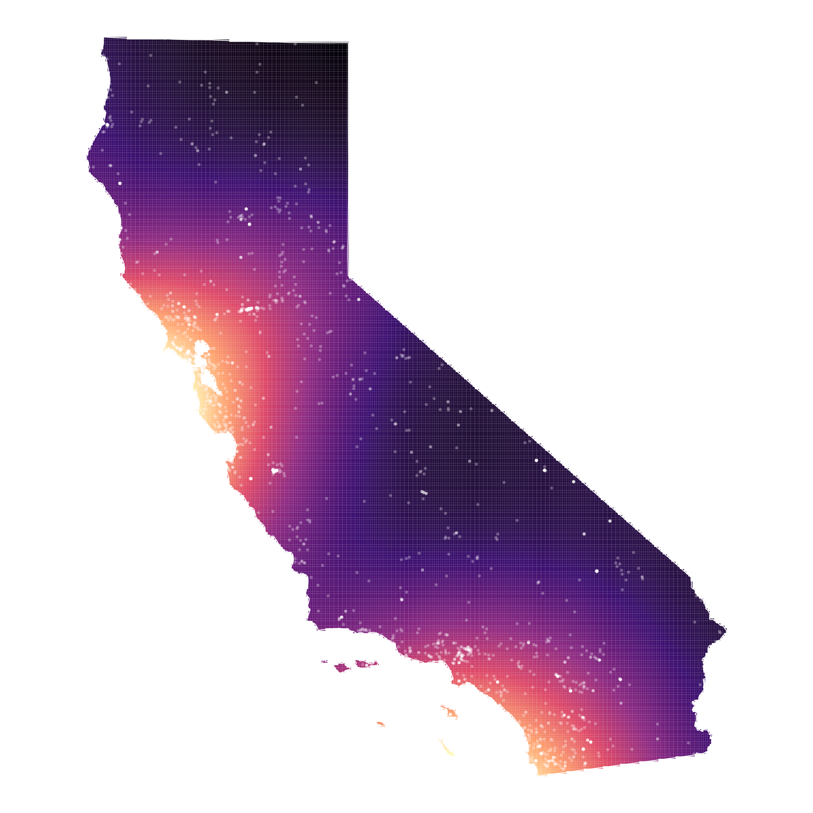
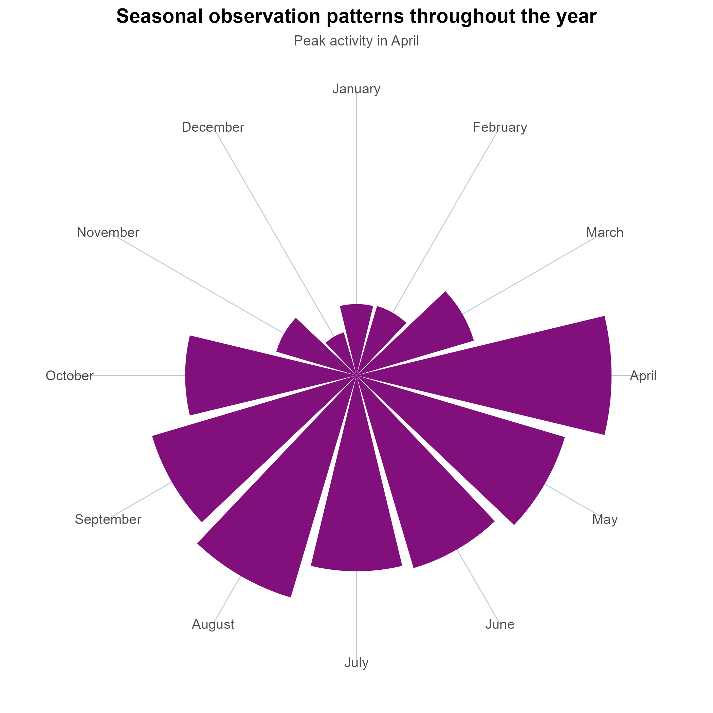

[{fig-alt="Picture: Michael Durham/Minden Pictures.BCI"}](https://www.batcon.org/bat/tadarida-brasiliensis/)

# Introduction:

Few things ruin a warm evening faster than the whine of a mosquito. As
California's climate shifts, mosquito season has been starting earlier,
fueled by warmer and wetter conditions. Fortunately, an unexpected group
of nighttime heroes is already on the job: bats. These nocturnal
neighbors are powerful pest-control allies, consuming enormous numbers
of insects each night, often eating 25–50% of their body mass before
sunrise.[^1] In doing so, bats save the agricultural industry billions
of dollars each year in reduced pesticide use and crop damage.

[^1]: FUJITA, M.S. and TUTTLE, M.D. (1991), Flying Foxes (Chiroptera:
    Pteropodidae): Threatened Animals of Key Ecological and Economic
    Importance. Conservation Biology, 5: 455-463.
    <https://doi.org/10.1111/j.1523-1739.1991.tb00352.x>

Insect-eating bats make up the majority of California's bat species, and
their ecological contributions extend far beyond pest control. Some bats
pollinate economically important plants, while others serve as
indicators of ecosystem health.[^2][^3] For example, species like the
northern hoary bat roost exclusively in tree foliage, making their
presence a sign of high-quality habitat. Yet despite these important
ecosystem services, bats remain largely invisible to most people.

[^2]: Kunz, T.H., Braun de Torrez, E., Bauer, D., Lobova, T. and
    Fleming, T.H. (2011), Ecosystem services provided by bats. Annals of
    the New York Academy of Sciences, 1223: 1-38.
    <https://doi.org/10.1111/j.1749-6632.2011.06004.x>

[^3]: Russo, D. and Leonardo A. (2015), Sensitivity of bats to
    urbanization: a review. Mammalian Biology 80: 205-212.
    https://doi.org/10.1016/j.mambio.2014.10.003

This is where citizen science becomes invaluable. Over the past 27
years, 975 observers on iNaturalist have documented bat sightings across
California. These observations help reveal where bats are being seen,
which species are present, and when sightings peak throughout the year.
Using this community-generated data, my visualization explores the
hidden patterns of bat observations across the state and highlights the
role these often-overlooked animals play in California's ecosystems.

{width="18.76in"}To understand
what citizen scientists have revealed about California's bats, I
analyzed 1,843 observations collected between 1998 and 2025. This
informed the design of my infographic, and three patterns emerged that
paint a picture of remarkable diversity coexisting with human
communities across the state.

## **What species are out there?**

The data reveal at least 993 research-grade confirmed bat species
documented by community observers, with the Mexican Free-tailed Bat
leading observations. What's particularly compelling is that 36% of
observations are still awaiting species-level identification, labeled as
"Unidentified Mouse-eared Bat" or "Unidentified Evening Bat." Rather
than being a data limitation, this tells an important story about
citizen science in action: everyday people are actively documenting bat
encounters even without expert knowledge, contributing valuable presence
data that experts can later verify and refine.

## **Where are they found?**

The heatmap and spatial pattern map reveals bats aren't confined to
remote wilderness, they're distributed across California's diverse
landscapes, from coastal edges to inland valleys. Observation density
clusters around populated areas, which likely reflects observer effort
(more people = more observations). One important caveat I wanted to be
transparent about: this map reflects where people report bat sightings,
not necessarily where bats live. iNaturalist data carries an inherent
urban bias, more people means more observations. Coastal cities appear
as hotspots partly because that's where most California residents live.
I acknowledged this directly in the map's caption rather than letting
the visualization imply a false objectivity.

## **When are they most active?**

The seasonal pattern shows a clear peak in April, with strong activity
continuing through fall. This spring surge aligns with bat breeding
season and the emergence of insects after winter, exactly when
insectivorous bats need maximum calories. Observations continue
year-round, though, suggesting California's mild climate supports active
bat populations even in winter months.

Together, these patterns reveal that citizen science isn't just
documenting bat presence, it's uncovering where conservation attention
is needed and when communities are most likely to encounter these
beneficial species.

# Design Decisions: From Urban Focus to Statewide Story

My initial goal was to highlight bats in urban communities specifically
to show city-dwellers that bats are right outside their windows. But the
data had other plans. iNaturalist's location data varies wildly in
precision. Some observations include exact street addresses, while
others are vague county-level descriptions like "San Diego County, CA."
When I filtered for observations containing "Los Angeles" or "San
Diego," I inadvertently captured national parks, wildlife refuges, and
regional wilderness areas, hardly urban ecosystems. I tried
text-matching exclusions, then considered spatial analysis tools to clip
observations to census-defined urban boundaries, but each approach felt
like forcing a narrative the data didn't support. Given that only 67
truly urban observations remained after aggressive filtering, I chose to
focus on the pattern strongly supported by the data rather than force a
limited urban narrative that would have introduced significant bias.

I chose honesty over my initial vision. The 1,843 statewide observations
tell a more compelling story anyway, bats thrive across California's
incredibly diverse landscapes, and that diversity itself is worth
celebrating. Below I break down the visual process of each plot and how
it went from Rstudio to Affinity Designer where all other design
elements where incorporated, adjusted, or altered.

The following code shows the pre-data process done before making simple
plots

```{r}
#| eval: false
#| echo: true
#| code-fold: true
#| code-summary: "Show the code"
#.........................load libraries.........................
library(tidyverse)
library(here)
library(lubridate)
library(sf)
library(spatstat)Ec
library(stars)
library(tigris) # for California state boundary
options(tigris_use_cache = TRUE) # to avoid re-downloading caches data

#..........................import data...........................

calbats <- read_csv(here("data", "observations.csv"))

# clean data 1018

bats_clean <- calbats %>% 
 filter(
    captive_cultivated == FALSE,
    # remove NAs
    !is.na(latitude),
    !is.na(longitude),
    !is.na(observed_on)
    ) %>% 
  mutate(
    date = ymd(observed_on),
    year = year(date),
    month = month(date, label = TRUE, abbr = FALSE),
# Relabel entries to reduce diversity count inflation (not all species have common names) 
    common_name = case_when(
    scientific_name == "Myotis"           ~ "Unidentified Mouse-eared Bat",
    scientific_name == "Vespertilionidae" ~ "Unidentified Evening Bat",
    scientific_name == "Vespertilionoidea"~ "Unidentified Vespertilionoid Bat",
    scientific_name == "Chiroptera"       ~ "Unidentified Bat",
    TRUE ~ common_name  # Keep all other common names as-is
  ))

```

## Visualizing the Unidentified

One design challenge became an unexpected strength: 36% of observations
aren't identified to species level. Initially, I considered excluding
these as "incomplete data." But that would have erased 635 observations
from people who spotted bats but lacked the expertise to distinguish a
California Myotis from a Yuma Myotis. That's exactly the kind of
participation citizen science depends on. Instead, I relabeled them as
"Unidentified Mouse-eared Bat" or "Unidentified Evening Bat" and
visually distinguished them from confirmed species using grayish blue
for unidentified, a medium purple for confirmed. This design choice
transforms a limitation into transparency, showing both what we know for
certain and the community engagement. Note: At this point my color theme
wasn't set yet, but I was experimenting with the `BuPu` color palette
from the `RColorBrewer` package were I got these color hexcodes.


```{r}
#| eval: false
#| echo: true
#| code-fold: true
#| code-summary: "Show the code"
#| fig-asp: 1
#| #| fig-alt: "A horizontal stacked bar chart showing the top 10 most observed bat species in California. Bars are split between identified species in purple and awaiting identification in light blue. The Mexican Free-tailed Bat dominates with 251 observations, the highest of any species. 64% of all observations are identified to species level."


# Top Species Observed plot
# Prepare top species data
top_species <- bats_clean %>%
  count(common_name, sort = TRUE) %>%
  slice_max(n, n = 10) %>%
  mutate(
    identified = !str_detect(common_name, "Unidentified"), # Create TRUE/FALSE column
    common_name = fct_reorder(common_name, n) # top observation at top
  ) %>% 
# Create bar plot
ggplot(aes(x = n, y = common_name, fill = identified)) +
  geom_col(alpha = 0.9) +
  scale_fill_manual(
    values = c("FALSE" = "#E0ECF4", "TRUE" = "#8856A7"),  # hexcodes from BuPu color palette 
    labels = c("Awaiting ID", "Identified to species"),
    name = NULL
  ) +
  labs(
    title = "Most documented Bat Species in California",
    subtitle = "Top 10 most observed species/groups",
    x = "Number of observations",
    y = NULL,
    caption = "64% of observations identified to species level"
  )  +
   theme_minimal(base_size = 12) +
  theme(
    plot.title = element_text(size = 14, face = "bold", hjust = 0),
    plot.subtitle = element_text(size = 11, color = "gray30"),
    plot.caption = element_text(size = 9, hjust = 0, color = "gray50"),
    legend.position = "top",
    panel.grid.major.y = element_blank(),      # Remove horizontal gridlines
    panel.grid.minor = element_blank(),
    axis.text = element_text(size = 10)
  )

print(top_species)
```

## Map Iterations

The geographic visualization went through several iterations. Initially,
I plotted bat sightings as individual points across California, a simple
and direct approach; however. with thousands of observations, the
visualization became overly dense, particularly in regions such as the
Bay Area and Los Angeles. I then tried a Density contour plot that
obscured the California state boundary. I almost settled with hexagonal
binning that aggregates observations into equal-area cells, revealing
hotspots but it was difficult to see high observations over low
observations. After some feedback and discussing my vision with my
colleagues I found the `{spatstat}` package, which calculates the
relative concentration of observations across continuous space rather
than binning points into arbitrary boundaries like counties or grids.
The results is a smooth heatmap where warmer colors reflect higher
observations density -giving the map a visual language that echos the
infographics broader dawn-to-dusk color story. Getting there requires a
few technical hurdles. The density calculation only works with
projections that use meters as their unit, so I transformed all the data
to California Albers (EPSG:3310) before converting observations to a
spatial point pattern object (`ppp`). From there, `density.pp()` handled
the math, and `{stars}` bridged the result back to a plottable `{sf}`
object. I opt-out the legend because the raw density numbers (like
0.0000003) are meaningless to a general audience. Instead I added a text
annotation in my infographic.



```{r}
#| eval: false
#| echo: true
#| code-summary: "Show the code"
#| fig-asp: 1
#| #| fig-alt: "A kernel density map of California showing bat observation hotspots. Brighter magma-colored areas indicate higher concentrations of reported sightings, clustering along the coast, Bay Area, and Southern California. Individual observation points are overlaid as small white dots resembling stars against a dark background."

# Observation heatmap steps
# CRS (California Albers - uses meters, works with density .ppp)
ca_crs <- 3310

# Get California state boundary
ca_state <- states(cb = TRUE) %>% 
  filter(NAME == "California") %>% 
  st_transform(ca_crs)

# Convert bat observation to sf, drop Nas, clip to CA
bats_sf <- bats_clean %>% 
  filter(!is.na(latitude), !is.na(longitude)) %>% 
  st_as_sf(coords = c("longitude", "latitude"), crs = 4326) %>% 
  st_transform(ca_crs) %>% 
  st_intersection(ca_state) # remove any points outside CA

# Convert to ppp object 
bats_ppp <- as.ppp(bats_sf$geometry, W = as.owin(ca_state))

# Calculate density
bats_density_stars <- stars::st_as_stars(density(bats_ppp, dimyx = 150)) # change to 300 to save image 150 for faster output

# Convert back to sf
bats_density_sf <- st_as_sf(bats_density_stars) %>% 
  st_set_crs(ca_crs)

# Plot
camap <- ggplot() +
  geom_sf(data = bats_density_sf, aes(fill = v), color = NA) +
  geom_sf(data = ca_state, fill = NA, color = "white", linewidth = 0.35) +
  geom_sf(data = bats_sf, color = "white", alpha = 0.2, size = 0.5) +
  scale_fill_viridis_c(option = "magma", guide = "none") +
  theme_void()

print(camap)
```

## Adapting the Radial Design

For the seasonal pattern, I chose a radial chart over a traditional bar
chart. While bar charts are more familiar, the circular format
reinforces that bat observations are cyclical. Spring leads to summer
leads to fall lead back to spring. The April peak becomes visual
prominent as the longest "spoke" on the wheel, and viewers can
intuitively grasp the year-round presence of bats even during winter
months. It also let me implement a creative design on my infographic by
not just being a data plot but providing a thematic visual element.



```{r}
#| eval: false
#| echo: true
#| code-fold: true
#| code-summary: "Show the code"
#| fig-asp: 1
#| #| fig-alt: "A circular radial chart showing monthly bat observation counts across the year. Bars radiate outward from the center for each month. April has the longest bar indicating peak observations. Bar colors are a dark violet."

# Prepare monthly data
monthly <- bats_clean %>%
  count(month) %>%
  mutate(month = factor(month, levels = month.name))  # Keep month order

# Create radial chart
april <-  ggplot(monthly, aes(x = month, y = n)) +
  
  # BARS: Radial bars from center outward
  geom_col(fill = "#810f7c", width = 0.9) +
  
  # MAKE IT CIRCULAR: coord_polar converts x-axis to circle
  coord_polar(start = -pi/12) +  # Rotate so January starts at top
  
  # LABELS
  labs(
    title = "Seasonal observation patterns throughout the year",
    subtitle = "Peak activity in April"
  ) +
  
  # THEME: Clean radial appearance
  theme_minimal(base_size = 12) +
  theme(
    plot.title = element_text(size = 14, face = "bold", hjust = 0.5),
    plot.subtitle = element_text(size = 10, color = "gray30", hjust = 0.5),
    plot.caption = element_text(size = 9, hjust = 0.5, color = "gray50"),
    axis.title = element_blank(),           # Remove axis labels
    axis.text.y = element_blank(),          # Remove radial axis numbers
    axis.ticks = element_blank(),           # Remove tick marks
    panel.grid.major.x = element_line(color = "#b3cde3", linewidth = 0.3),# Month dividers
    panel.grid.major.y = element_blank(),   # Remove circular gridlines
    panel.grid.minor = element_blank()
  )
print(april)
```

## Bringing it All Together: Typography, Color, and Accessibility

With three distinct visualizations built, the final design challenges
was weaving them into a cohesive visual story. I brought all elements
into Affinity Designer, where typography, color, and layout decisions
were refined together rather than in isolation.

For typography, I paired Century Schoolbook for the titles with Garamond
for body text and captions. Century Schoolbook's sturdy, classic serifs
give the title hierarchy weight and presence while Garamond's elegant,
lighter letter forms keep the supporting text readable without competing
for attention. Both are serif fonts, which gives the infographic a
consistent, editorial quality, fitting for a science communication
piece.

Color decisions were made at the infographic level rather than the plot
level. The dawn gradient background, transitioning from deep night sky
to warm morning light, anchors the entire composition thematically and
gives each visualization a natural home: the dark density map sits in
both night and day, the radial sun glows at the dawn horizon.

Accessibility shaped several choices throughout. The magma palette on
the density map and the orange-to-gold gradient on the radial chart both
maintain strong contrast across their ranges. I avoided relying on color
alone to communicate meaning, each plot uses position, labels, or
annotations as a secondary channel.

Finally, framing bats as "hidden neighbors" rather than threats was
itself an accessibility choice, making the subject approachable and
empathy-building for audiences who might otherwise disengage.
